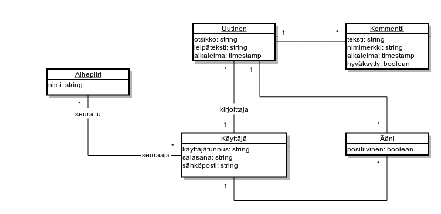
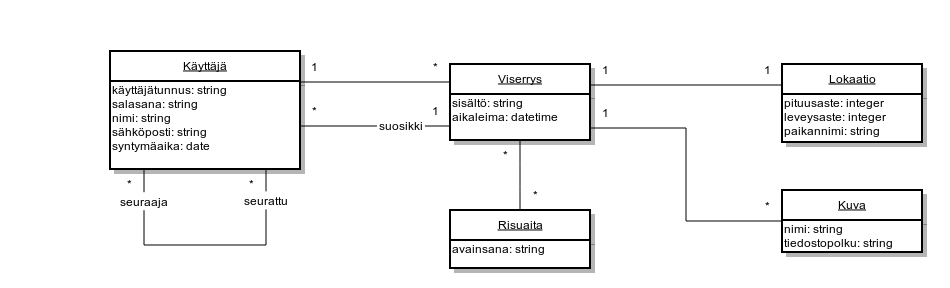
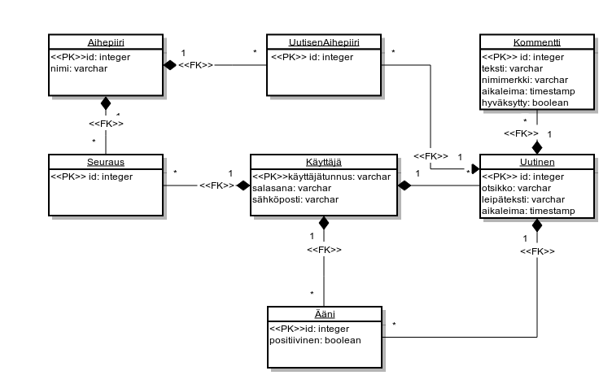
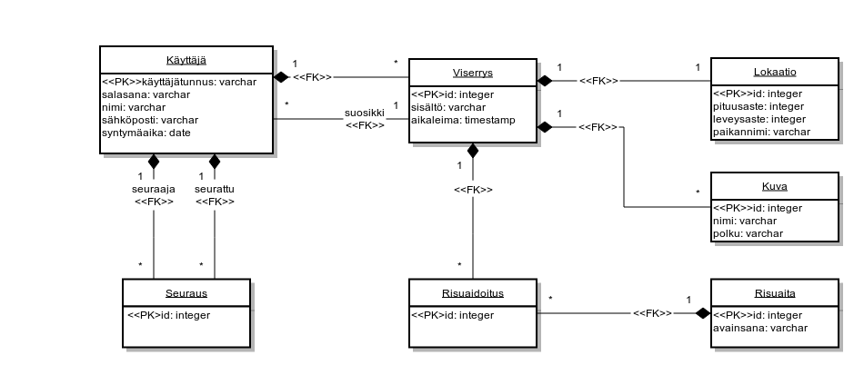

# Arvosteluperusteet

* Tietosisältökartoitus (0,5p)
  * Tietokohteet ja niiden attribuutit löydetty ja esitetty erikseen.
* Käsitekaavio (UML), josta selviää tietokohteet ja niiden väliset relaatiot sekä kohteisiin liittyvät oleelliset tietoelementit ja hahmottelua siitä, millaisilla arvoilla tietoelementit esitetään. Käsitekaaviota tuetaan lyhyellä kuvauksella. (1p)
  * Piirretty kaavio, josta näkyy tietokohteet ja niiden väliset relaatiot. Alustavat arvotyypit attribuuteilla.
* Tietokantakaavio ja tietokannan taulujen kuvaukset SQL:n CREATE TABLE -lauseina sekä näitä selkeyttäviä kommentteja. (1p)
  * Edelliseen kaavioon lisättynä mahdolliset lisätaulut sekä lopulliset tietotyypit. Kaavio esitettynä CREATE TABLE -lauseilla.
* Pienet esimerkkitaulut sisällöistä (0,5p)
  * Tauluille keksitty oikeanlaista sisältöä. Ei esim. väärää tietotyyppiä sarakkeessa ja asetettuja rajoitteita noudatettu.
* Muutama keskeinen käyttötapaus ja näitä vastaavat kyselyt (0,5p)
  * Esitetty vähintään kolme järkevää kyselyä kuvauksineen.
* Havaitut ongelmat ja omia pohdintoja + riippuvuusanalyysi tauluista (0,5p)
  * Esitetty huomioita esim. järjestelmän käyttövaatimuksista, mahdollisista ongelmista ja parannusehdotuksista.

## Käsitekaavioesimerkit

### luinsen

### Viserrin

## Tietokantakaavioesimerkit

### luinsen

### Viserrin

